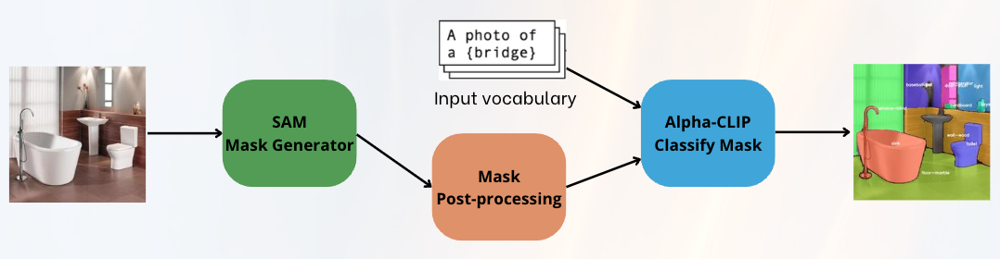
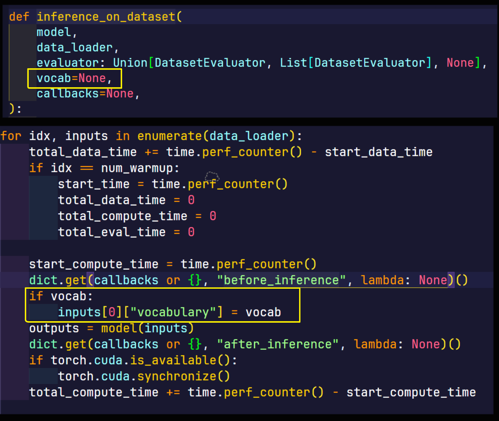

<div align="center">
  
  
  
</div>

<p align='center'>
    <h1 align="center">Open vocabulary semantic segmentation</h1>
    <p align="center">
    Project for Trends and application of computer vision at the University of Trento A.Y.2024/2025
    </p>
    <p align='center'>
    Developed by:
    Gheser Amir, Roman Simone and Mascherin Matteo
    </p>   
</p>

----------


- [Project Description](#project-description)
  - [SAN](#san)
  - [SAM](#sam)
  - [Experiments](#experiments)
- [Installation](#installation)
  - [Install dependencies](#install-dependencies)
  - [Download dataset](#download-dataset)
  - [Download models](#download-models)
- [Running the project](#running-the-project)
  - [Evaluating SAM with Our Pipeline](#evaluating-sam-with-our-pipeline)
  - [Evaluating SAN](#evaluating-san)

## Project Description
For this project, our goal is to explore advanced methods for open-vocabulary semantic segmentation (OVSS), aiming to segment images into regions defined by arbitrary textual concepts. Our research investigates two main approaches: SAN (Side Network) and SAM (Segment Anything), comparing their performance and adaptability in OVSS tasks.

<p align="center">
  
</p>

### SAN
The <a href="https://arxiv.org/abs/2302.12242">Side Adapter Network (SAN)</a> is a lightweight framework designed for open-vocabulary semantic segmentation, leveraging CLIP's pre-trained vision-language capabilities. SAN models segmentation as a region recognition task by attaching a side network to CLIP with two branches: one for mask proposals and the other for attention bias, enabling CLIP-aware segmentation. Its end-to-end training maximizes adaptation to CLIP, ensuring accurate, efficient predictions. Compared to alternatives, SAN achieves state-of-the-art performance with up to 18x fewer parameters and 19x faster inference. It excels in resource efficiency while delivering high-quality segmentation across diverse datasets.


### SAM

<a href = "https://segment-anything.com/">Segment anything (SAM)</a> is the state of the art AI framework for object segmentation across diverse domains. To adapt SAM to OVSS task we propose a two-stage approach where SAM acts as a class-agnostic mask generator, and <a href = "https://arxiv.org/abs/2312.03818">Alpha-CLIP</a> is employed for mask classification. Post-processing techniques, such as BBox filtering and background adjustments, refine the mask proposals for enhanced segmentation accuracy in open-vocabulary settings.

<p align="center">
  
</p>

### Experiments
We conducted the following experiments to evaluate the performance of our pipeline:

1. **Pipeline Post-Processing Analysis**:  
   We tested the pipeline using various types of post-processing techniques to determine their impact on the overall performance.

2. **Model Evaluation with Different Datasets and Vocabularies**:  
   - We explored the effectiveness of **SAN** (Side-Adapter Network) and **SAM** (Segment Anything Models) across multiple datasets.  
   - For each dataset, we used two different vocabulary sources:  
     - **Caption-generated Vocabulary**: Derived from captions generated by the BLIP-2 model.  
     - **Label-based Vocabulary**: Created from predefined dataset labels.  


## Installation
> [!WARNING]
> To run the experiments you need python 3.10


### Install dependencies
In order to install all the dependencies launch this command:
```bash
sh setup.sh
```
### Download dataset
First configure appropiately the 'datasets.yaml' file. Download the missing values and then run the following commands:
```bash
python download_dataset.py
# After manually getting the missing values
sh preprocess_dataset.sh
```
### Download models

* SAN           -- [model zoo](https://github.com/MendelXu/SAN?tab=readme-ov-file#pretrained-weights)   -- [default](https://huggingface.co/Mendel192/san/resolve/main/san_vit_b_16.pth)
* SAM           -- [model zoo](https://github.com/facebookresearch/segment-anything?tab=readme-ov-file#model-checkpoints)   -- [default](https://dl.fbaipublicfiles.com/segment_anything/sam_vit_h_4b8939.pth)
* AlphaCLIP     -- [model zoo](https://github.com/SunzeY/AlphaCLIP/blob/main/model-zoo.md)  -- [default](https://drive.google.com/file/d/11iDlSAYI_BAi1A_Qz6LTWYHNgPe-UY7I/view?usp=sharing)

> [!NOTE]
AlphaCLIP only has google drive link working, so you need to download it manually and place it in the 'models' folder.


## Running the project

You can find examples of how to use **SAN** (Side Adapter Network) and **SAM** (Segment Anything Model) in the `notebook` directory. These examples demonstrate practical implementations and workflows for applying these models effectively.


### Evaluating SAM with Our Pipeline

To evaluate SAM using our pipeline, follow these steps:

1. Browse the `configs` directory and select the preferred configuration file that suits your dataset and vocabulary requirements.
2. Launch the pipeline using the following command:

  ```bash
   python sam_pipeline.py
  ```

### Evaluating SAN

To evaluate SAN, on ADE20K dataset, using a custom vocabulary, follow these steps:

1. First, you need to slightly change the `inference_on_dataset` function in the `evaluator.py` file inside detectron2 in order to perform predictions with a custom vocabulary using the SAN model.

You can find the file in the following path: `your_venv/lib/python3.10/site-packages/detectron2/evaluation/evaluator.py`. And then you need to change the inference_on_dataset function as shown in the following images:

<center>

</center>


2. Browse the `dataset/captions_val` directory and select the preferred vocabulary you want to test on (e.g., `nouns_ade_filtered.pkl` or `nouns_coco_filtered.pkl`, for nouns extracted and filtered from ADE20K and COCO datasets, respectively).

3. Launch the SAN evaluation from the SAN directory using the following command:

  ```bash
  cd SAN
  python eval_net.py --eval-only --config-file configs/san_clip_vit_res4_coco.yaml --vocabulary ../datasets/captions_val/nouns_ade_filtered.pkl  OUTPUT_DIR ../output/[Name of the output folder] MODEL.WEIGHTS ../checkpoints/san_vit_b_16.pth DATASETS.TEST "('ade20k_full_sem_seg_val',)"                            
  ```

Adjust the `--vocabulary` parameter to the desired vocabulary file and the `OUTPUT_DIR` parameter to the desired output folder name. Take a look to [SAN official repository](https://github.com/MendelXu/SAN) for more information.

# Contacts
For any inquiries, feel free to contact:

- Simone Roman - [simone.roman@studenti.unitn.it](mailto:simone.roman@studenti.unitn.it)

- Amir Gheser - [amir.gheser@studenti.unitn.it](mailto:amir.gheser@studenti.unitn.it)

- Matteo Mascherin - [matteo.mascherin@studenti.unitn.it](mailto:matteo.mascherin@studenti.unitn.it)


<br>

<div>
    <a href="https://www.unitn.it/">
        
    </a>
</div>
